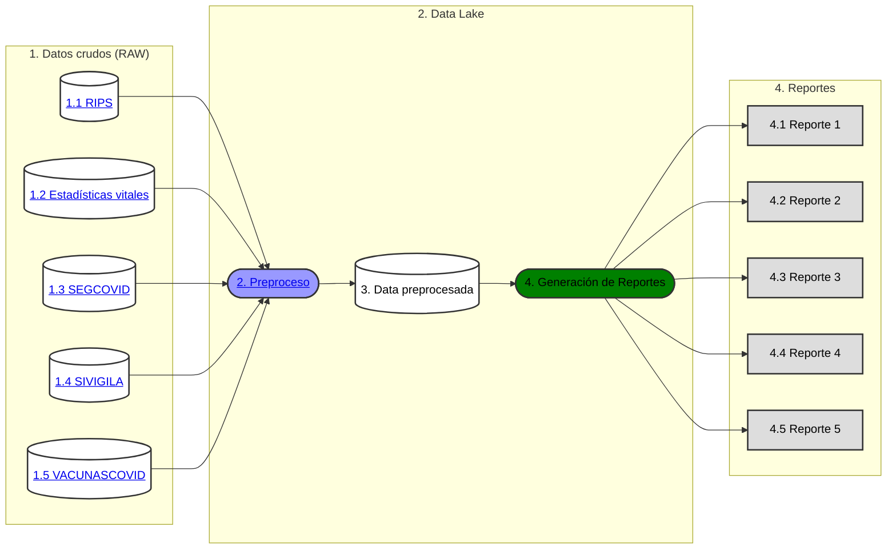
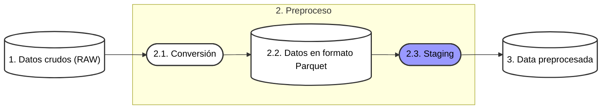

# Data Lake

## Objetivos
- Probar inter-operabilidad de fuentes de información grandes (Big Data) del sistema de salud en Colombia.
- Generar modelos descriptivos y predictivos. 

## Flujo de datos

# 2. Preproceso

## 2.2. Conversión
## 2.3. Datos en formato Parquet
## 2.4. Staging
## 2.5. Data preprocesada

# 3. Data Lake
# 4. Generación de Reportes
## 4.1 Reporte 1
## 4.2 Reporte 2
## 4.3 Reporte 3
## 4.4 Reporte 4
## 4.5 Reporte 5

