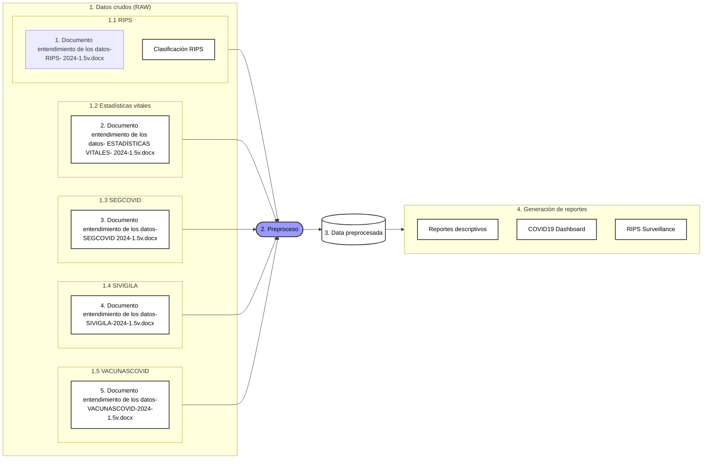

# Data Lake

## Objetivos
- Probar inter-operabilidad de fuentes de información grandes (Big Data) del sistema de salud en Colombia.
- Generar modelos descriptivos y predictivos. 

## Flujo de datos

