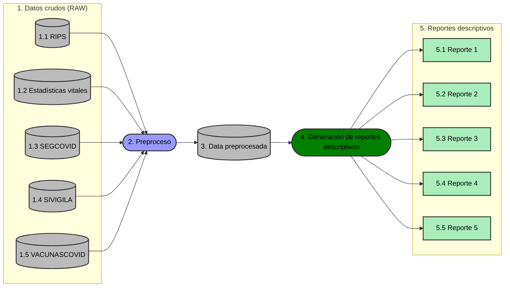

# Data Lake

## Objetivos
- Probar inter-operabilidad de fuentes de información grandes (Big Data) del sistema de salud en Colombia.
- Generar modelos descriptivos y predictivos. 

## Flujo de datos

# 1. Datos crudos (RAW)
- 1.1 RIPS: [1. Documento entendimiento de los datos-RIPS- 2024-1.5v.docx - Google Docs](https://docs.google.com/document/d/1v1sbOreJdBO0SDKUqhwKxVJw9MxYego8/edit)
- 1.2 Estadísticas vitales: [2. Documento entendimiento de los datos- ESTADÍSTICAS VITALES- 2024-1.5v.docx - Google Docs](https://docs.google.com/document/d/1iS1R8nHHWaVkTCsxTbTI5t9atf6AJeuR/edit)
- 1.3 SEGCOVID: [3. Documento entendimiento de los datos-SEGCOVID 2024-1.5v.docx - Google Docs](https://docs.google.com/document/d/1ErjxN7yliQpPZoOO_h-7L-Qg5XQCONbd/edit)
- 1.4 SIVIGILA: [4. Documento entendimiento de los datos-SIVIGILA-2024-1.5v.docx - Google Docs](https://docs.google.com/document/d/17mFQoDqTd8Azzy9971D3XkibAzFu6egv/edit)
- 1.5 VACUNASCOVID: [5. Documento entendimiento de los datos-VACUNASCOVID-2024-1.5v.docx - Google Docs](https://docs.google.com/document/d/1kIC2y6j7VdZ7J-GziTIGz7EuRUx8Aec9/edit)

# 2. Preproceso

[AGORA-COL/Data_lake: Lago de datos del Proyecto ÁGORA](https://github.com/AGORA-COL/Data_lake)

# 3. Data preprocesada
# 4. Generación de reportes descriptivos
[AGORA-COL/dl-covid19-descriptive-reports: Repositorio de procesos de verificación y análisis de los datos del proyecto del Lago de Datos de AGORA](https://github.com/AGORA-COL/dl-covid19-descriptive-reports)

