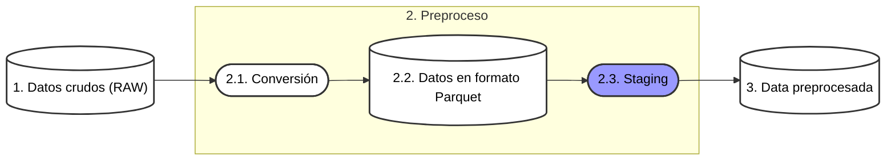

# 2. Preproceso

```mermaid
flowchart LR
    R[("1. Datos crudos (RAW)")]
    subgraph 2. Preproceso
        direction LR
        C(["2.1. Conversión"])
        P[("2.2. Datos en formato Parquet")]
        S(["2.3. Staging"])
    end
    D[("3. Data preprocesada")]

    R --> C --> P --> S --> D

    class R data;
    class C process;
    class P data;
    class S process;
    class D data;

    classDef data fill:white,stroke:#333,stroke-width:2px,color:#000;
    classDef process fill:#99f,stroke:#333,stroke-width:2px,color:black;
    classDef repository fill:#fff,stroke:#333,stroke-width:2px,stroke: 5 5,color:#000;
    classDef process2 fill:green,stroke:#333,stroke-width:2px,color:#000;
    classDef report fill:#ddd,stroke:#333,stroke-width:2px,color:#000;

    class A,B,C,D,E data;
    class F process;
    class DL repository;
    class R1,R2,R3,R4,R5 report;
    class G process2;    

    

```
- [AGORA-COL/Data_lake: Lago de datos del Proyecto ÁGORA](https://github.com/AGORA-COL/Data_lake)

