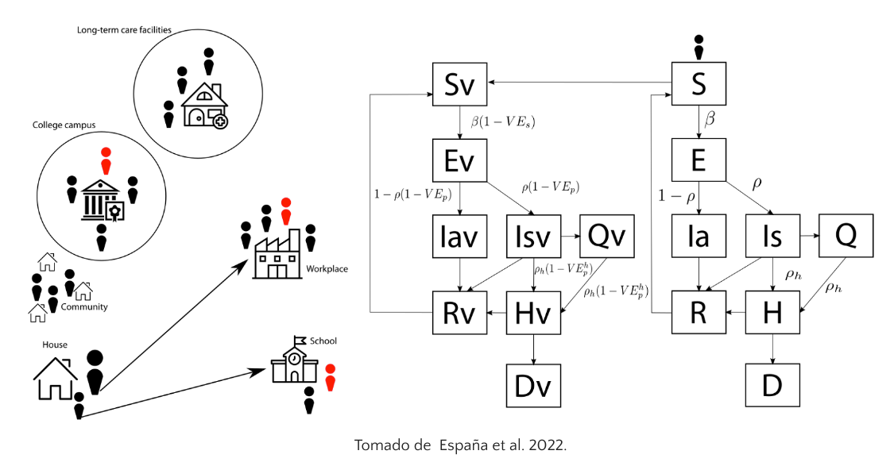
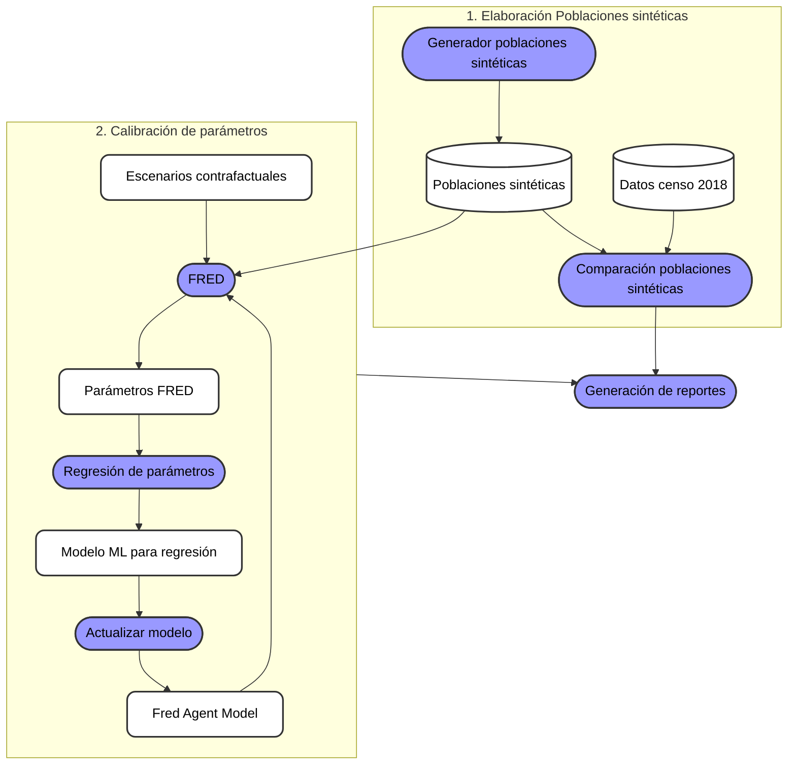

# Modelo dinámico y de Agentes

El modelo FRED (Grefenstette et al., 2013) permite explorar cómo una enfermedad se propaga dentro de una población a través del tiempo.

En este caso, se utiliza para simular el proceso de dispersión del virus SARS-CoV-2 en cada departamento de Colombia.

# Flujo de datos

