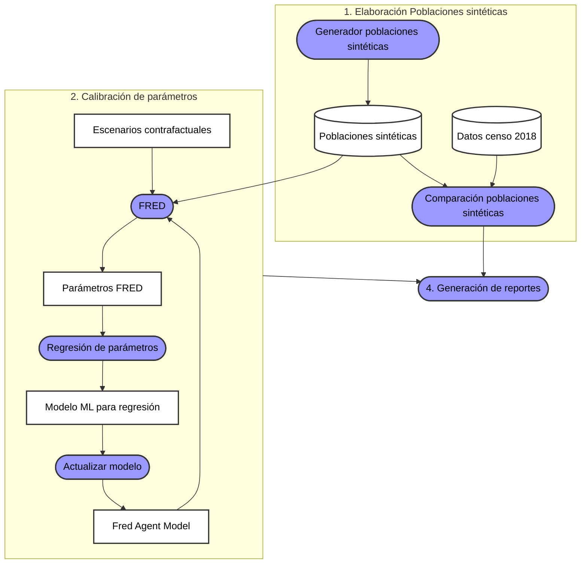

# Modelo dinámico y de Agentes

El modelo FRED (Grefenstette et al., 2013) permite explorar cómo una enfermedad se propaga dentro de una población a través del tiempo.

En este caso, se utiliza para simular el proceso de dispersión del virus SARS-CoV-2 en cada departamento de Colombia.

# Flujo de datos

# 1. Elaboración Poblaciones sintéticas
- [AGORA-COL/synthetic_populations: Training in synthetic populations by doing the Guido's scripts](https://github.com/AGORA-COL/synthetic_populations)

# 2. Calibración de parámetros
## Regresión de parámetros
## Modelo ML para regresión
Modelo ML para regresión de parámetros FRED calibrados
[AGORA-COL/fred_parameters_regression: This repo contains the ML model for the regression of calibrated FRED parameters](https://github.com/AGORA-COL/fred_parameters_regression)

## Actualizar modelo

# 3. Escenarios contrafactuales

# 4. Reportes
- [AGORA-COL/model-reports](https://github.com/AGORA-COL/model-reports)

# FRED
## FRED Software
- [AGORA-COL/FRED: This is a duplicate of FRED from PHDL repository specific for COVID-19](https://github.com/AGORA-COL/FRED)
## FRED Agent Model
- [AGORA-COL/fred_colombia_implementation: Implemetation of the agent model FRED for the description of the COVID-19 outbreak in Colombia](https://github.com/AGORA-COL/fred_colombia_implementation)

